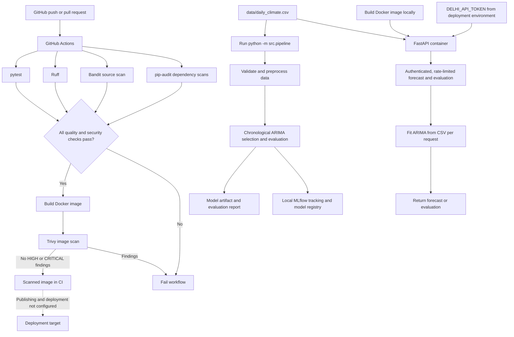

# Delhi Daily Temperature Forecasting

A starter project for exploring Delhi daily mean temperature and producing
ARIMA forecasts with a small HTTP API.

## Dataset

The project includes `data/daily_climate.csv`. It contains daily `date`,
`meantemp`, `humidity`, `wind_speed`, and `meanpressure` columns. The
exploration notebook audits types, missing data, duplicate and missing dates,
IQR outliers, and plausible measurement ranges before forecasting. It flags the
Jan 1, 2017 `meanpressure` value of `59.0` as implausible and masks it in the
in-memory cleaned copy rather than guessing a corrected value or changing the
source CSV. See [data/README.md](data/README.md) for the data contract.

## Setup

```powershell
py -3.11 -m venv .venv
.\.venv\Scripts\Activate.ps1
python -m pip install -r requirements.txt
```

## Architecture

The current implementation has three related but separate flows: pull-request
and push checks in GitHub Actions, an explicitly invoked training/evaluation
pipeline, and the containerized inference API.



The CI image is built and scanned but is not published to a registry or
deployed. The training pipeline is run separately by the developer; it logs
and registers models in the local MLflow store. The API currently reads the
CSV and fits its ARIMA model per request—it does not load the pipeline's saved
or registered model. Connecting model promotion, serving the registered
artifact, image publishing, and deployment requires a configured registry,
deployment target, and credentials.

## Explore and evaluate

Start Jupyter from the project root and open
`notebooks/01_exploration.ipynb`. The notebook inspects and cleans the climate
data in memory, plots the temperature series, evaluates an ARIMA model on a
chronological holdout, and creates a 7-day forecast. It does not automatically
remove IQR outliers or fill missing measurements. It also plots the trailing
7-day rolling mean and standard deviation, compares monthly temperature
summaries, and displays autocorrelation through 30 days. The CSV spans only
January through April 2017, so these monthly comparisons do not establish a
full annual seasonal cycle. It runs an Augmented Dickey–Fuller test on the
earliest selection-training segment and, only if that segment fails to reject
the unit-root null at 5%, first-differences it and tests again. On the current
chronological split, the 67-point selection-training level series has an ADF
statistic of about `-2.177` (`p = 0.215`); its first difference has an ADF
statistic of about `-8.658` (`p = 4.9e-14`), rejecting the unit-root null at
5%. ACF/PACF plots of the differenced selection-training series guide a
candidate search; the notebook compares AIC/BIC and validation errors while
reserving the final 30 days as an untouched holdout. All splits are chronological:
earlier observations are used for fitting and later observations for validation
or testing; rows are never randomly shuffled. The notebook shows the train/test
date ranges and fits the final selected and baseline ARIMA models on `train`
only. The selected default is
ARIMA(1, 1, 0) by validation RMSE (`3.861`); AIC/BIC favor the simpler
ARIMA(0, 1, 0) on the fitting segment, whose validation RMSE is `3.881`.
On the untouched final holdout, ARIMA(1, 1, 0) achieved RMSE `4.423`,
compared with `4.914` for the previous ARIMA(5, 1, 0) default. Final holdout
metrics for ARIMA(1, 1, 0) are MAE `3.95 °C`, RMSE `4.42 °C`, and MAPE
`12.51%` (versus `4.47 °C`, `4.91 °C`, and `14.21%` for the previous default).
MAPE is reported as undefined if any actual value is zero.

## MLflow experiment tracking

The notebook tracks each ARIMA candidate and final holdout fit in the
`Delhi Temperature Forecasting` MLflow experiment. Runs log the ARIMA order,
AIC/BIC, MAE, RMSE, MAPE, and validation/test period metadata, and register
each fitted model under `DelhiTemperatureARIMA`. MLflow assigns a monotonically
increasing model version and stores the fitted model artifact. The tracking
database and artifacts are local (`mlflow.db` and `mlruns/`) and are excluded
from Git.

After running the notebook from the project root, inspect the experiments and
registered versions with:

```powershell
mlflow ui --backend-store-uri sqlite:///mlflow.db
```

Then open `http://127.0.0.1:5000`.

## Run the API

Set a per-deployment bearer token in the environment before starting the API.
This is not a third-party API key; it is your own secret token for this project.
Generate a strong value and keep it in your local shell or deployment secret store:

```powershell
$env:DELHI_API_TOKEN = (& .\.venv\Scripts\python.exe -c "import secrets; print(secrets.token_urlsafe(32))")
# Print the generated token so you can enter it in the dashboard.
Write-Output $env:DELHI_API_TOKEN
uvicorn app:app --reload --host 127.0.0.1 --port 8081
# or: uvicorn src.api.main:app --reload --host 127.0.0.1 --port 8081
```

Use the exact same token in the browser or in `Authorization: Bearer <token>`
requests. Any random string of at least 32 characters works as long as it matches
what the server is configured to expect.
`OPENAI_API_KEY` is optional. On page load, the dashboard shows a small dialog
for an OpenAI key; skipping it leaves live weather forecasts available without
AI. An entered key is held only in tab memory and sent to this app's backend
when you request an AI result; it is not persisted or logged, and is cleared
when the tab reloads. Anyone controlling the browser can inspect a key while
using it, so do not use this on a shared or untrusted device; use HTTPS if
exposed beyond localhost. Open the address printed by Uvicorn
(normally `http://127.0.0.1:8081/`) to use the dashboard.

- `GET /health` checks that the service is running.
- `GET /` serves the forecasting dashboard.
- `GET /dashboard-data` remains available for historical ARIMA details; the
  dashboard's current-weather chart does not use this old CSV data.
- `GET /locations/search?q=Mumbai` searches place names through Open-Meteo's
  geocoding service. The dashboard allows a user to select a result or click a
  point on the interactive OpenStreetMap map.
- `POST /weather-forecast` accepts `days`, `latitude`, `longitude`, `location`,
  and `timezone` (all location fields default to Delhi, India) and returns daily
  mean-temperature estimates plus the latest available current conditions from
  Open-Meteo for that selected place. Current conditions are weather-model
  estimates, not independent station observations. For horizons beyond the
  provider's 16-day limit, it returns only the first 16 sourced forecast days
  and reports the requested horizon separately.
- `POST /forecast/explanation` accepts `days`, location fields, and optionally
  `openai_api_key`, and returns an optional OpenAI-generated explanation of
  Open-Meteo data. The key can instead be provided as the server's
  `OPENAI_API_KEY` environment value.
- `POST /forecast/ai-estimate` accepts the same fields and returns a separate
  experimental AI comparison for requested dates through day 16, or retains
  the sourced first 16 days and adds experimental AI estimates after day 16,
  up to 365 days. If OpenAI is unavailable or no key is supplied for a long
  horizon, it returns a clearly labeled constant-temperature baseline after
  day 16 instead. AI-generated values are speculative and unvalidated, not
  genuine daily weather forecasts. The dashboard labels and plots both types
  separately from Open-Meteo.
- `POST /forecast/question` accepts `days`, location fields, `question`, and
  optionally `openai_api_key`. It answers questions using the available
  Open-Meteo forecast for the selected location and states when requested
  information is outside that data.
- `POST /forecast` and `GET /forecast?steps=7` remain available for the local
  ARIMA model based on the included historical CSV; this series ends in 2017 and
  is not the source for the dashboard's current weather forecast.
- `GET /evaluate?test_size=30` evaluates against the final observations.
- Forecast and evaluation endpoints require `Authorization: Bearer <token>`.
  Tokens must be at least 32 characters. `/health` remains unauthenticated for
  container/orchestrator probes.
- Forecast/evaluation endpoints are limited to 30 requests per minute per
  client address; AI explanations, projections, and questions are limited to
  10 requests per minute.
- Open `http://127.0.0.1:8081/`, enter the same `DELHI_API_TOKEN` used to start
  the server, select a forecast horizon, and generate a chart. The token is
  held only in the page's memory and sent as a bearer header to this same-origin
  API. It is not stored in browser storage.
- Interactive API documentation is available at `/docs`.

The dashboard lets users choose a place by searching its name or clicking its
map location, select 1–365 days, and switch the chart between Celsius and
Fahrenheit. Unit conversion is display-only; API values remain in Celsius.
The latest available Open-Meteo current conditions (temperature, feels-like,
weather description, humidity, precipitation, and wind) are also shown and
passed to AI explanations, estimates, and Q&A with their model timestamp and
source link. These are current weather-model estimates rather than ground-truth
observations or independent cross-provider verification.
Place-name search uses Open-Meteo
geocoding; the interactive map and its tiles use Leaflet and OpenStreetMap and
therefore require an internet connection in the browser. Open-Meteo is the
sourced daily forecast only for the first 16 days. If requested, OpenAI creates a separate,
experimental projection for later dates; an LLM is not a meteorological model,
so those later values are not reliable daily predictions or weather advice.
If OpenAI is unavailable for a long horizon, the dashboard instead shows the
last sourced daily mean repeated as a plainly labeled baseline.
The AI question area uses the user's question plus the available short-range
forecast, and should acknowledge when facts are unavailable.
The legacy ARIMA endpoints use the local CSV and
the default ARIMA order `(1, 1, 0)`, selected using the notebook's
chronological validation workflow.

Example POST request:

```powershell
Invoke-RestMethod -Method Post -Uri http://127.0.0.1:8081/weather-forecast `
  -Headers @{ Authorization = "Bearer $env:DELHI_API_TOKEN" } `
  -ContentType "application/json" -Body '{"days":7}'
```

The dashboard charts daily mean-temperature estimates returned by
`POST /weather-forecast`. It labels Open-Meteo as the source and does not plot
the old CSV as though it were recent weather history.

## Run the automated pipeline

Run the complete data validation, preprocessing, chronological model selection,
training, evaluation, MLflow tracking, and artifact-writing workflow with one
command:

```powershell
python -m src.pipeline
```

By default, it reads `data/daily_climate.csv`, selects an ARIMA order using a
chronological validation segment, evaluates on the final 30 days, saves the
fitted model to `models/delhi_arima.pkl`, writes metrics and split details to
`models/evaluation.json`, and registers the evaluated model in the local MLflow
registry. The model is fitted on the pre-test training partition only; the
final test observations are not used for fitting or model selection.

Options are available for custom data and artifact locations:

```powershell
python -m src.pipeline --help
python -m src.pipeline --data data/daily_climate.csv --test-size 30
```

Run it from the project root so the default dataset and local MLflow database
resolve consistently.

## Tests

```powershell
python -m pytest
```

## Docker

Build and run the API container:

```powershell
docker build -t delhi-temperature-forecast .
docker run --rm -p 8000:8000 -e DELHI_API_TOKEN delhi-temperature-forecast
```

The container runs as a non-root user, includes a Docker health check, and
serves the API on port `8000`. Provide `DELHI_API_TOKEN` through your
deployment's secret manager/environment configuration; never bake it into the
image, Dockerfile, or source tree. `/health` can be checked at
`http://127.0.0.1:8000/health`.

The built-in rate limiter is process-local. For multiple workers, replicas, or
deployment behind a proxy, enforce a shared limit at a trusted API gateway or
reverse proxy; do not trust client-supplied forwarded-IP headers.

## Secure CI/CD

The [secure CI workflow](.github/workflows/secure-ci.yml) runs on pushes, pull
requests, and manual dispatch. It runs the test suite, Ruff linting, a
`pip-audit` dependency scan, and a Bandit source scan. Any reported dependency
vulnerability fails the dependency-audit step; medium-or-higher severity,
medium-or-higher confidence Bandit findings fail the source scan. Only after
those checks pass does CI build the Docker image and scan it with Trivy;
unfixed findings are ignored, while reported high- and critical-severity
vulnerabilities fail the workflow. The workflow uses read-only repository
permissions and pinned GitHub Actions revisions. Protect the default branch
with this workflow's checks required before merging.

The [`.dockerignore`](.dockerignore) file keeps local environments, MLflow
data, model outputs, notebook/test files, and common secret-file formats out of
the Docker build context.

GitHub's native secret scanning and push protection must be enabled in the
repository's **Settings → Code security and analysis**; GitHub availability
depends on the repository plan and visibility. No deployment job is configured
yet because this project has no deployment target or credentials configured.
